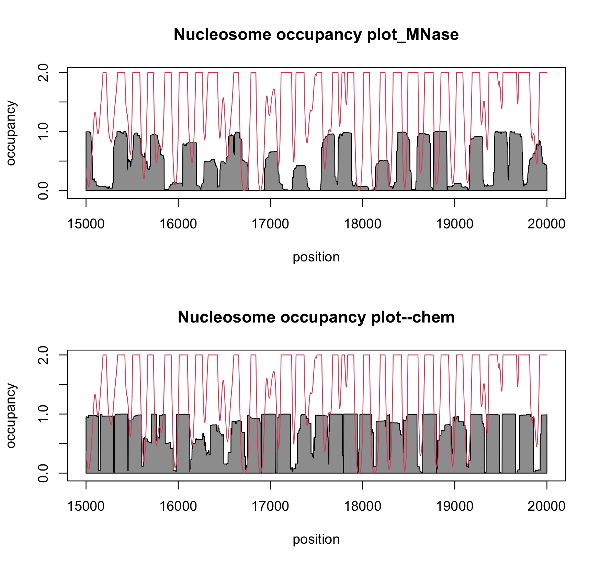

**Maintainer**: Ji-Ping Wang, <<jzwang@northwestern.edu>>

```{r setup, include = FALSE}
library(NuPoP)
knitr::opts_chunk$set(
    collapse = TRUE,
    comment = "#>"
)
```

**References for methods**:

1. Wang, J.-P., Fondufe-Mittendorf, Y., Xi, L., Tsai, G.-F., Segal, E., and Widom, J. (2008). Preferentially quantized linker {DNA} lengths in *Saccharomyces cerevisiae*. *PLoS Computational Biology*, 4(9):e1000175.
2. Xi, L., Fondufe-Mittendorf, Y., Xia, L., Flatow, J., Widom, J., and Wang, J.-P.
  (2010). Predicting nucleosome positioning using a duration hidden markov
  model. *BMC Bioinformatics*, pages doi:10.1186/1471--2105--11--346.
3. Xi, L., Brogaard,K., Zhang, Q., Lindsay, B.G., Widom, and Wang, J.-P., A locally convoluted cluster model for nucleosome positioning signals in chemical map, *Journal of American Statistical Association*, 2013, 109(505) 48-62

**References for chemical map data used**:

3. Brogaard, K., Xi, L., Wang, J.-P. and Widom, J. (2012), A base pair resolution map of nucleosome positions in yeast, *Nature*, 2012, 486: 496–501
4. Moyle-Heyrman, G., Zaichuk, T., Xi, L., Zhang, Q., Uhlenbeck, O.C., Holmgren, R., Widom, J. and Wang, J.-P., Chemical map of Schizosaccharomyces pombe reveals species-specific features in nucleosome positioning, *PNAS* , 2013,110(50),20158-20163	
5. Voong, L.N, Xi, L., Sebeson, A.C., Xiong, B., Wang, J.-P., Wang, X. Insights into Nucleosome Organization in Mouse Embryonic Stem Cells through Chemical Mapping , *Cell*, 2016, 167(6),1555-1570.e15 

## Version 2 hightlights
*NuPoP* V2 added a funciton **predNuPoP_chem** for prediction of nucleosomes using profiles trained based on chemical maps of nucleosomes for yeast, pombe, mouse and human (profiles for other species are extrapolated based on yeast profile). To show a clear improvement, the following figure compares the prediction based on MNase profile vs chemical profile for yeast where the red curve super-imposed is the occupancy from the chemical map for yeast data. 

```{r echo=FALSE, out.width='75%'}

```

## About NuPoP

*NuPoP* is an R package for **Nu**cleosome **Po**sitioning **P**rediction. *NuPoP*
is built upon a duration hidden Markov model, in which the linker DNA length is
explicitly modeled. The nucleosome or linker DNA state model can be chosen
as either a fourth order or first order Markov chain. *NuPoP* outputs the Viterbi
prediction of optimal nucleosome position map, nucleosome occupancy score (from backward and forward algorithms) and nucleosome affinity score.


In addition to the R package, we also developed a stand-alone Fortran program available at https://github.com/jipingw/NuPoP_Fortran. *NuPoP* R package and the Fortran program  can predict nucleosome positioning for a DNA sequence of any length.


## NuPoP functions
*NuPoP* does not depend on any other R packages. It has four major functions, **predNuPoP**, **predNuPoP_chem**, **readNuPoP**, and **plotNuPoP**. The **predNuPoP** function predicts the nucleosome positioning and nucleosome occupancy using MNase data trained nucleosome profiles while **predNuPoP_chem** predicts using profiles trained based on chemical maps. the **readNuPoP** function reads in the prediction results, and the  function **plotNuPoP** visualizes the predictions. 

```{r}
library(NuPoP)
```

The **predNuPoP** and **predNuPoP_chem**  call a Fortran subroutine to process the DNA sequence and make predictions, and outputs the predictions into a text file into the current working directory. This method is based on a duration Hidden Markov model consisting of two states, one for the nucleosome and the other for the linker state. For each state, a first order Markov chain and a fourth order Markov chain models are built in. For example, a sample DNA sequence is `test.seq` located in `inst/extdata` subdirectory of the package. Call the `predNuPoP`
function as follows:

```{r,eval=FALSE}
predNuPoP(system.file("extdata", "test.seq", package="NuPoP"),species=7,model=4)
```

Note that the argument `file` must be specified as the complete path and file name of the DNA sequence in FASTA format in any directory. For example, if the "test.seq" file is located in `/Users/jon/DNA`, the function can be called by 

```{r,eval=FALSE}
predNuPoP(file="/Users/jon/DNA/test.seq",species=7,model=4)
```
or for chemical map prediction:
```{r,eval=FALSE}
predNuPoP_chem(file="/Users/jon/DNA/test.seq",species=7,model=4)
```

The user should not use `file="~/DNA/test.seq"` to speficify the path to avoid error messages.
The argument `species` can be specified as follows: 1 = Human; 2 = Mouse;  3 = Rat; 4 = Zebrafish; 5 = D. melanogaster; 6 = C. elegans; 7 = S. cerevisiae; 8 = C. albicans; 9 = S. pombe; 10 = A. thaliana;  11 = Maize; 0 = other.  If species = 0 is specified, the algorithm will identify a species from 1-11 that has most similar base composition to the input sequence, and  use the models from the selected species for prediction. The default value is 7. The argument `model` can be either 1 or 4, standing for the order of Markov chain models used for the nucleosome and linker states. 

For `predNuPoP_chem`, only species 1 (human), 2 (mouse), 7 (yeast), 9(S.pombe) are using actual profiles trained from chemical mapps of corresponding species. For other species, there are no chemical map data vailable. Extrapolated profiles based on yeast data with adjustment for base composition are used.

The output file, generated in the current working directory, will be named after the sequence file name, with an added extension as `_Prediction1.txt` or `_Prediction4.txt`. For the above codes, the output file will be `test.seq_Prediction4.txt`. Note that `predNuPoP_chem` and `predNuPoP` do not distinguish the output names.  The five columns in the output file are  

1. `Position`: position in the input DNA sequence.
2. `P-start`: probability that the current position is the start of a nucleosome.
3. `Occup`: nucleosome occupancy score. The nucleosome occupancy score is defined as the probability that the given position is covered by a nucleosome.
4. `N/L`: 1 indicates the given position is covered by nucleosome and 0 for linker linker based on Viterbi prediction.
5. `Affinity`: nucleosome binding affinity score. This affinity score is defined for every 147 bp of DNA sequence centered at the given position. Therefore for the first and last 73 bp of the DNA sequence, the affinity score is not defined (indicated as NA).

The output file can be imported into R by `readNuPoP` function:
```{r,eval=TRUE}
results=readNuPoP(system.file("extdata", "test.seq_Prediction4.txt", package="NuPoP"),startPos=1,endPos=5000)
results[1:5,]
```
The genomic sequence can be extremely long. The user can import a part of the predictions by specifying the start position `startPos` and the end position `endPos` in the `readNuPoP` function. For example, to visualize prediction results  from `startPos=1` to `endPos=5000`,
```{r}
#par(mar=c(2,2,2,2))
plotNuPoP(results)
```


# Session info

```{r sessionInfo}
sessionInfo()
```


